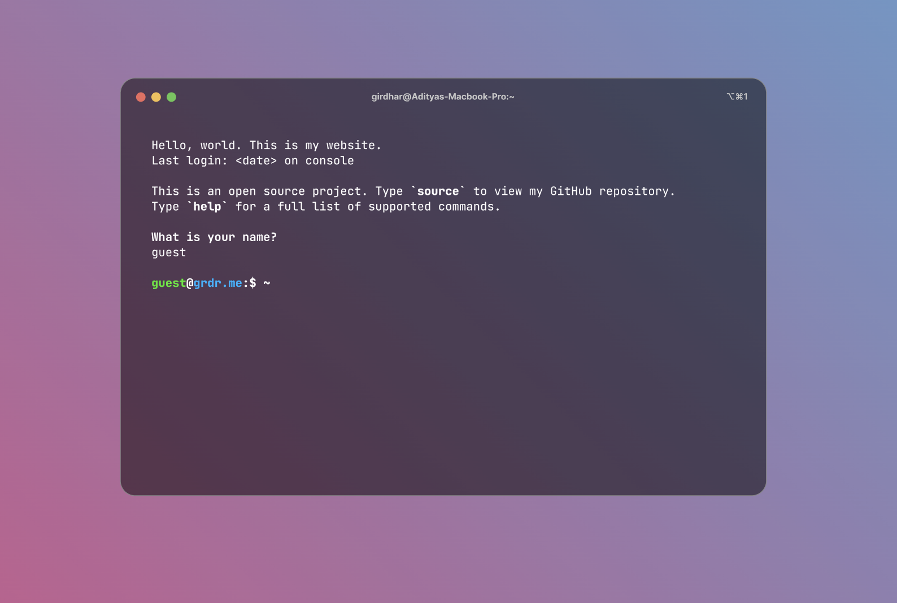

# Untitled

Jump to Instructions | Jump to Documentation

## 👩🏻‍💻 HackerFolio: The terminal template that’s cool

When I was choosing a template for my portfolio website, I found a lot of ‘terminal-style’ portfolio templates. As someone who spends the majority of his time in the terminal (neovim fan) I immediately liked the idea, but none of the templates I saw were, daresay, elegant.

And so HackerFolio was born. Here’s a snippet of how it looks:

## 🚀 Features

- A satisfying animated gradient in the background (can configure it to cycle between colours you like)
- A transparent and slightly frosted terminal window
- Support for custom user login
- All the data is modularised in the `config.js` file. Just replace the placeholders with your information and build.

## 🙌🏻 How to use

- Replace placeholders with your personal details in `config.js`
- Navigate to project directory and execute `$ npm run build`
- Your website files are now in the `build` folder, ready to be deployed on a static server of your choice. Recommendations: GitHub Pages, Netlify, Vercel

## 📑 Documentation

TBD